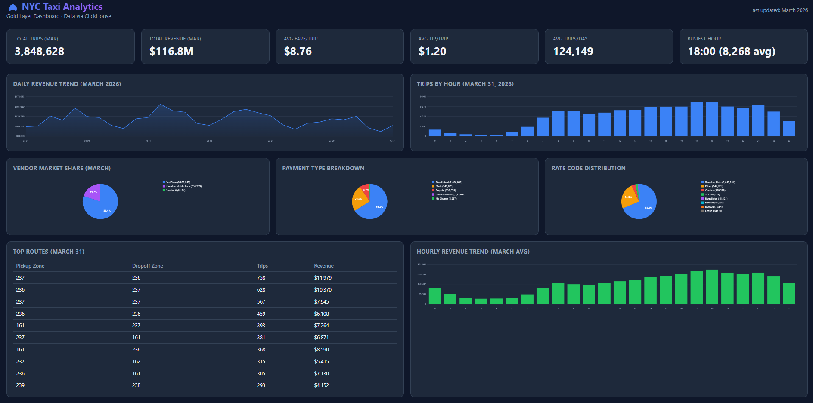

# NYC Taxi Analysis

## Overview
This project builds an end-to-end data analytics pipeline using ClickHouse and Power BI to analyze NYC taxi trip data.

## Architecture
- Bronze → raw data ingestion
- Silver → cleaned and structured data
- Gold → aggregated analytics for reporting

## Tools Used
- ClickHouse (data warehouse)
- Python (query execution)
- Power BI (dashboard visualization)
- GitHub (version control)

## Key Insights
- Peak taxi demand occurs between 5 PM and 7 PM
- Demand is concentrated in a small number of pickup locations
- Trip volume fluctuates daily with notable anomalies
- Different segments show similar trends, indicating shared external factors

## Project Highlights
- Built end-to-end data pipeline
- Applied Kepner-Tregoe analytical framework
- Designed business-focused dashboard
- Used AI-assisted workflow for development and debugging

## Dashboard

*Figure: Power BI dashboard showing taxi demand trends, time patterns, and location-based analysis derived from the Gold layer.*
``
